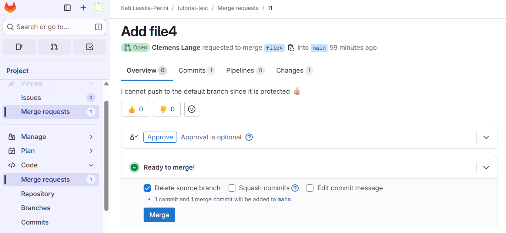

:::::::::::::::::::::::::::::::::::::: questions

- How to best work on the same code?

::::::::::::::::::::::::::::::::::::::::::::::::

::::::::::::::::::::::::::::::::::::: objectives

- Add contributors
- Understand roles
- Use of branches.
::::::::::::::::::::::::::::::::::::::::::::::::

## Let's start collaborating!


Now we come to the collaborative work. 

In general, there are two approaches:

::::::::::::::::::::::::::::::::::::: callout
[Fork and pull](https://docs.github.com/en/pull-requests/collaborating-with-pull-requests/getting-started/about-collaborative-development-models#fork-and-pull-model)

*In the fork and pull model, anyone can fork an existing repository and push changes to their personal fork. You do not need permission to the source repository to push to a user-owned fork. The changes can be pulled into the source repository by the project maintainer. When you open a pull request proposing changes from your user-owned fork to a branch in the source (upstream) repository, you can allow anyone with push access to the upstream repository to make changes to your pull request. This model is popular with open source projects as it reduces the amount of friction for new contributors and allows people to work independently without upfront coordination.*

::::::::::::::::::::::::::::::::::::::::::::::::

::::::::::::::::::::::::::::::::::::: callout
[Shared repository](https://docs.github.com/en/pull-requests/collaborating-with-pull-requests/getting-started/about-collaborative-development-models#shared-repository-model)

*In the shared repository model, collaborators are granted push access to a single shared repository and topic branches are created when changes need to be made. Pull requests are useful in this model as they initiate code review and general discussion about a set of changes before the changes are merged into the main development branch. This model is more prevalent with small teams and organizations collaborating on private projects.*

::::::::::::::::::::::::::::::::::::::::::::::::

We will be using automated workflows, some of which require authentication features stored as "secrets" in the repository, and they will not be available in forks. Therefore, we choose working on a **shared repository** where all contributors are added as members.


::::::::::::::::::::::::::::::::::::: challenge

### Exercise 04.1 - shared repository

Work in pairs or in small groups. Add all participants as a member to the shared repository. 

Choose their roles.

:::::::::::::::: solution

In the shared repository, go to Manage -> Members.

In the CERN GitLab instance, you can find all CERN accounts, including service accounts:


Learn about the roles.

Note in particular the branch rules and protected branches, see them in Settings -> Repository.

Only owners or maintainers can push directly to the default branch.

:::::::::::::::::::::::::
:::::::::::::::::::::::::::::::::::::::::::::::

::::::::::::::::::::::::::::::::::::: challenge

### Exercise 04.2 - contributing to a shared repository

One of you is the invited member, the other is the owner.
Choose the roles so that the less experiences Git use becomes the owner.

As an invited member, clone the repository to your local computer.

Make an update in the code, then stage and commit it.
Try what happens if you try to push to the main branch:

:::::::::::::::: spoiler

### Pushing to a protected branch is not allowed

You will see a message similar to this:

```
remote: GitLab: You are not allowed to push code to protected branches on this project.
To gitlab.com:<project address>
 ! [remote rejected] HEAD -> main (pre-receive hook declined)
error: failed to push some refs to 'gitlab.com:<project address>'
```

::::::::::::::::::::::::

Create a new branch instead.

```
git checkout -b <branch name>
```

Push your changes to the remote reposoitory. It will now appear as a merge request.

As the owner, review the merge request but do not merge it yet as you will test it locally in the next exercise.


:::::::::::::::: solution

Make the changes with the usual Git workflow. Note that if you have a local repository with the same name, you will need to define another local name to the newly cloned local area:

```
git clone <git address> <local-repo-name>
cd <local-repo-name>
```
Create a new branch:

```
git checkout -b new-feature
```

Do the edits and then

```
git add .
git commit -m "Describe your updates"
git push origin new-feature 
```

This will now appear as a merge request and the repository owner can review and merge it.




Browse through the tabs and see the changes. Do not merge it yet as we continue to the next exercise to test it locally

:::::::::::::::::::::::::
:::::::::::::::::::::::::::::::::::::::::::::::


::::::::::::::::::::::::::::::::::::: challenge

### Exercise 04.3 - checking a new feature branch locally

As the project owner or maintainer, test the new feature locally. You would do this, for example, to run some code locally to see if it works as expected.

Use `git fetch origin` to get the latest changes and then checkout the new branch.

Once tested, merge the request on the GitLab Web UI and delete your local branch.


:::::::::::::::: solution

Retreive the status of the remote repository so that you know the new branch name.

```
$ git fetch origin
remote: Enumerating objects: 12, done.
remote: Counting objects: 100% (12/12), done.
remote: Compressing objects: 100% (8/8), done.
remote: Total 11 (delta 3), reused 0 (delta 0), pack-reused 0 (from 0)
Unpacking objects: 100% (11/11), 1.67 KiB | 25.00 KiB/s, done.
From gitlab.com:<project address>
   395b0d5..6372999  main       -> origin/main
 * [new branch]      file4      -> origin/file4
```

Checkout the branch with

```
git checkout -b file4 origin/file4
```

To test, you might run some code locally. 
You can delete this local branch after testing. You may need option `-D` to force it.


:::::::::::::::::::::::::
:::::::::::::::::::::::::::::::::::::::::::::::


::::::::::::::::::::::::::::::::::::: callout
### Remember to update your local main/master branch!!!

After a merge request have been merged, remember to update your local default branch.

```
git checkout main
git pull
```

Do this every time when you start a new development.

You can also delete your previous branch:

```
git branch -d new-feature
```

::::::::::::::::::::::::::::::::::::::::::::::::


::::::::::::::::::::::::::::::::::::: keypoints 

- If the use of automated workflows is planned, it is convenient to work in a shared repository instead of using forks.
- You will use branches to contribute to the shared repository (unless you are the owner or the maintainer).


::::::::::::::::::::::::::::::::::::::::::::::::