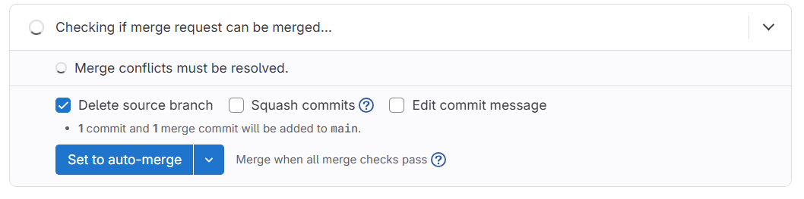
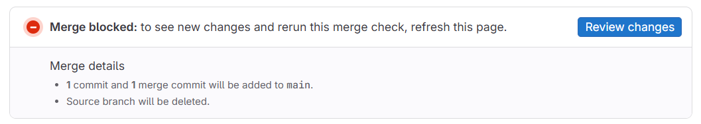
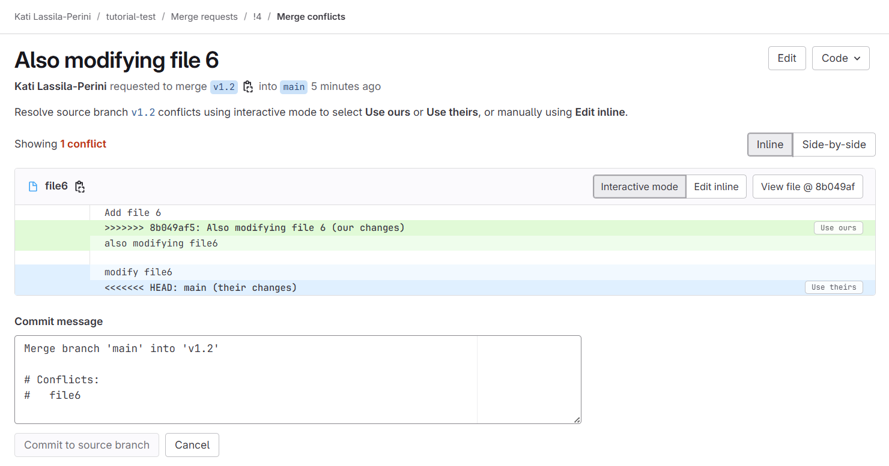

:::::::::::::::::::::::::::::::::::::: questions

- How to solve conflicts in code?

::::::::::::::::::::::::::::::::::::::::::::::::

::::::::::::::::::::::::::::::::::::: objectives

- Rebasing your working branch to a recent updates in the default branch
- Solving conflicting edits in files
- Defining best practices for contributions
::::::::::::::::::::::::::::::::::::::::::::::::

## Enter panic mode!

Everybody is frantically working on the code repository. The owner commits straight to the default branch, developers push from their own branches… and soon, conflicts explode.

To keep the conflict on the code — not between people — we’ll practice breaking things on purpose and then fixing them.


::::::::::::::::::::::::::::::::::::: challenge

### Exercise 05.1

Exercise with your pair to add content to you shared repository in the default branch. You can do so if both of you have at least maintainer rights to the repository. Learn how to update your working area with contents of the updated remote.

One of you makes a new local edits. Meanwhile, the other one updates the remote default branch with new files.


:::::::::::::::: solution

If you try to push, you will see a message like this:

```
 ! [rejected]        main -> main (fetch first)
error: failed to push some refs to 'gitlab.com:katilp/tutorial-test.git'
hint: Updates were rejected because the remote contains work that you do not
hint: have locally. This is usually caused by another repository pushing to
hint: the same ref. If you want to integrate the remote changes, use
hint: 'git pull' before pushing again.
hint: See the 'Note about fast-forwards' in 'git push --help' for details.
```

A bare `git pull`, as suggested in the message most likely gives:

```
   2f8c69a..d32176b  main       -> origin/main
hint: You have divergent branches and need to specify how to reconcile them.
hint: You can do so by running one of the following commands sometime before
hint: your next pull:
hint:
hint:   git config pull.rebase false  # merge
hint:   git config pull.rebase true   # rebase
hint:   git config pull.ff only       # fast-forward only
hint:
hint: You can replace "git config" with "git config --global" to set a default
hint: preference for all repositories. You can also pass --rebase, --no-rebase,
hint: or --ff-only on the command line to override the configured default per
hint: invocation.
```

Get the remote changes with

```
git pull --rebase
```

and then push your updates.

Did this work in your case?

:::::::::::::::::::::::::
:::::::::::::::::::::::::::::::::::::::::::::::

::::::::::::::::::::::::::::::::::::: challenge

### Exercise 05.2

Exercise with your pair to add content to you shared repository in two different branches. Learn how to update your working branch with contents of the updated remote.

One of you makes a new local edits to a local working branch. Meanwhile, the other one updates the remote default branch with new files. 


:::::::::::::::: solution

Create a new branch, make edits, and push them to the shared repository with

```
git push origin <your branch name>
```

Then make a merge request from the GitLab Web UI.

If the branches diverge you will see a message about it and you can click on "Rebase source branch" and accept


GitLab checks for conflicts 



and once done gives



Follow the link, and if there are no conflicts, your can merge again.

Note that you could have avoided this by rebasing before pushing. You could have refreshed your main:

```
git checkout main
git pull
```

then moved to your working branch and rebased (after the local commit)

```
git checkout <your branch name>
git rebase main
```

If there are not conflicts, i.e. edits to the same files, you would get a message:

```
First, rewinding head to replay your work on top of it...
Applying: <your commit message>
```

:::::::::::::::::::::::::
:::::::::::::::::::::::::::::::::::::::::::::::


::::::::::::::::::::::::::::::::::::: challenge

### Exercise 05.3

With your pair, make local edits to the same file in the shared repository.

One of you edits a file in a local working branch. Meanwhile, the other one updates the same file in the remote default branch.

Observe the error messages when trying to merge and learn to solve conflicts with confidence!

Exercise conflict solving on the GitLab Web UI and with the Git command line tools.


:::::::::::::::: solution

Do your edits (to the same file that has meanwhile been modified) in a working branch.
Commit and push your branch to remote. Go to the branch in the GitLab Web UI and make a merge request.

When trying to merge from the GitLab Web UI, you will see this


Clicking on "Solve locally" gives instructions to copy-paste to solve them by fetching the branch locally.

Clicking on "Resolve conflicts" gives an online tool to choose among the two divergent versions or to edit inline



Update the file as needed, commit and merge.

See also https://docs.gitlab.com/user/project/merge_requests/conflicts/


:::::::::::::::::::::::::
:::::::::::::::::::::::::::::::::::::::::::::::

::::::::::::::::::::::::::::::::::::: challenge

### Exercise 05.5

If you have enjoyed resolving conflicts, go ahead with your exercise pair to make further simultaneous divergent changes to the directory structure and the files in the shared repository.


:::::::::::::::: solution

See below! 

:::::::::::::::::::::::::
:::::::::::::::::::::::::::::::::::::::::::::::

::::::::::::::::::::::::::::::::::::: callout
### Avoid modifying the same files simultaneously!

Small conflicts are easy to solve but big divergences are a pain.

Organise the code and its development so that developers can work on separate files.

::::::::::::::::::::::::::::::::::::::::::::::::

::::::::::::::::::::::::::::::::::::: callout
### Avoid big, long-lived development branches!

Read [this instructive comment](https://www.reddit.com/r/git/comments/1autxuy/comment/kr7cuul/) on reddit:

*A lot of people use branches as a comfort mechanism. Hiding your code until it's 'perfect' feels safer. Not having your code merged until someone has spent a load of time reviewing it line by line feels safer. The reality is getting changes out there means issues are found sooner, only reviewing changes in PRs delays opportunity to give early feedback on the approach or solution.*

::::::::::::::::::::::::::::::::::::::::::::::::


::::::::::::::::::::::::::::::::::::: callout
### Remember to update your local main/master branch!!!

You will avoid a good amount of problems, if you remember to update your local default branch.

```
git checkout main
git pull
```

Do this every time when you start a new development.

::::::::::::::::::::::::::::::::::::::::::::::::

::::::::::::::::::::::::::::::::::::: keypoints 

- Git is the tool for managing collaborative work on code.
- Git automatically integrates changes when it’s safe, and asks you to resolve things when there’s a conflict.
- Conflicts are not errors—they’re a normal part of working with shared code. But resolving them is an extra step for developers or maintainers.
- Merging your work into the default branch regularly prevents large conflicts and saves effort.

::::::::::::::::::::::::::::::::::::::::::::::::