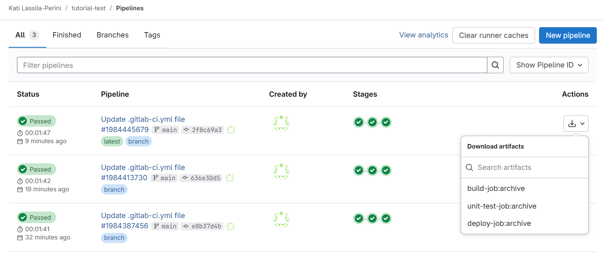
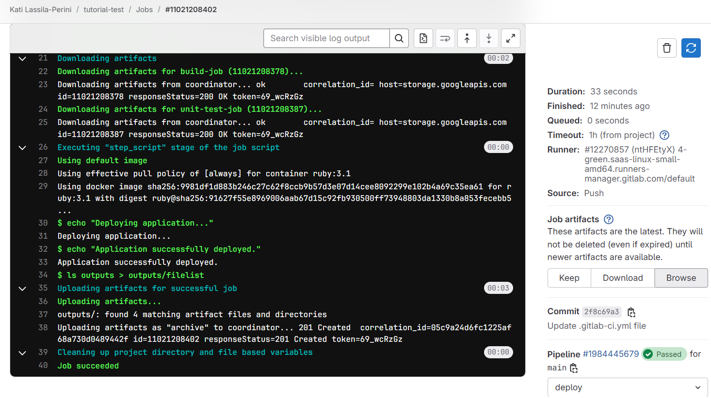

:::::::::::::::::::::::::::::::::::::: questions

- How to automate testing of code updates?

::::::::::::::::::::::::::::::::::::::::::::::::

::::::::::::::::::::::::::::::::::::: objectives

- Understand basic GitLab CI/CD pipeline concepts
- Run your first CI/CD pipeline
- Define a test
- Use artifacts
::::::::::::::::::::::::::::::::::::::::::::::::

## GitLab CI/CD pipelines

CI/CD stands for Continuous Integration and Continuous Delivery.
It means that updates are frequently integrated into the codebase and their functionality is tested, so the software is close to "deliverable" at any point in time.


[CI/CD pipelines](https://docs.gitlab.com/ci/pipelines/) 
are automated workflows that can be configured to run when new code is updated, or scheduled to run at regular intervals.

When developers push code to GitLab, they can define automated tasks in a `.gitlab-ci.yml` file. These tasks might include running tests, building applications, or deploying code. GitLab Runner is the application that executes these tasks on computing infrastructure. GitLab.com offers computing infrastructure for these tasks, and the CERN GitLab instance has access to dedicated infrastructure at CERN.

`yml` (or sometimes `yaml`) is quite commonly used language in various workflow definitions and fairly easy to read and understand.
Keep in mind, however, that correct indentation is crucial, as YAML uses indentation to define structure.
.

We will first have a look at the template that GitLab suggests in the "Pipeline editor".

::::::::::::::::::::::::::::::::::::: challenge

### Exercise 07.1

On the exercise repository, follow **Build -> Pipeline editor** and click on "Configure pipeline"

Inspect it, commit it and follow **Build -> Pipelines** to see it running.

:::::::::::::::: solution

While inspecting, observe:

- stages with default names `build`, `test` and `deploy`, see https://docs.gitlab.com/ci/yaml/#stages
- that this a typical software industry pipeline structure that builds a tool that is then deployed
- scripts usually consist of shell commands (or scripts)

Once done you will see something like this:


:::::::::::::::::::::::::
:::::::::::::::::::::::::::::::::::::::::::::::

## Exit codes

Remember that in the earlier exercises, the repository owner pulled the new feature branch locally to test it. This process could also be done automatically.

To do that, we need a test that either passes or fails, which the pipeline can interpret.

Unix exit codes can be used for this purpose. Every command returns an exit code — 0 for success or greater than 0 for failure. You can display the exit code of the last command in the terminal with `echo $?`.

You can make a script to stop at the first command that returns a non-zero exit code with `set -e`.

You can read more about exit codes in the [HSF GitLab tutorial](https://hsf-training.github.io/hsf-training-cicd/02-enter-sandman/index.html).

::::::::::::::::::::::::::::::::::::: challenge

### Exercise 07.2

Exercise with shell commands.
Exercise with a python test or a shell script.

:::::::::::::::: solution

Type `echo $?` after a command on your terminal.

Write a bash script `test.sh` with some commands in it. Test what happens when you run the script.

:::::::::::::::::::::::::
:::::::::::::::::::::::::::::::::::::::::::::::

Now we go back to the exercise repository, so just a reminder:

::::::::::::::::::::::::::::::::::::: callout
### Remember to update your local main/master branch!!!

Always remember to update your local default branch.

```
git checkout main
git pull
```

Do this every time when you start a new development.


::::::::::::::::::::::::::::::::::::::::::::::::

::::::::::::::::::::::::::::::::::::: challenge

### Exercise 07.3

Add a test to the pipeline template.
The repository files are available in the jobs.
You could test, for example, the contents of the files in the repository, or some other functionality.
Keep it simple, we'll get to the real work soon.


:::::::::::::::: solution

Replace the default `echo ...` and `sleep ...` commands in the `.gitlab-ci.yml` file with test commands of your own. You can also add a test script and run it.

```

```

:::::::::::::::::::::::::
:::::::::::::::::::::::::::::::::::::::::::::::

## Artifacts

In physics analysis, the outcome of the workflow — for example, a result file or a plot — is the best indicator that the code works as expected.

Such outcomes can be defined as artifacts in GitLab CI/CD pipelines, and they can be accessed through the GitLab Web UI.


You can define artifacts in the `.gitlab-ci-yml` file, and they are by default available to all stages of the pipeline. Note that artifacts cannot be modified, so if you plan to use the output of one step and modify it in a subsequent step, you will need to make a local copy of it in that job.


::::::::::::::::::::::::::::::::::::: challenge

### Exercise 07.4

Add an artifact to your CI/CD pipeline.

:::::::::::::::: solution

You can use something similar to this:

```
  script:
    - mkdir -p outputs
    - echo "Compiling the code..." > outputs/build.txt
    - echo "Compile complete." >> outputs/build.txt
  artifacts:
    paths:
      - outputs/
```

You can check in the subsequent job scripts that what you write in the `outputs` directory is visible. Only the jobs that have the `artifacts:` keyword, store them as artifacts to be downloaded. However, even if without the keyword, the `outputs` directory is available in all jobs.

You can download the artifacts from the Pipeline view:



or browse them by clicking on a single job, and following "Browse":




:::::::::::::::::::::::::
:::::::::::::::::::::::::::::::::::::::::::::::


::::::::::::::::::::::::::::::::::::: keypoints 

- GitLab CI/CD pipelines are useful to test the functionality of the code updates.
- They can perform decicated tests or procude a sample output which can indicate that the code works as expected.


::::::::::::::::::::::::::::::::::::::::::::::::