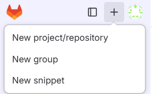
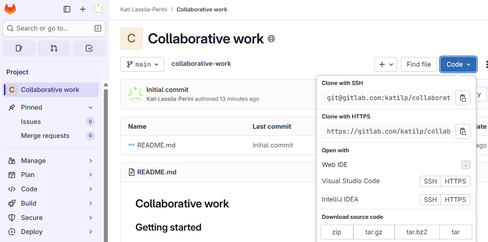

:::::::::::::::::::::::::::::::::::::: questions

- Phew! Luckily I haven't pushed yet — how can I change my commit?
::::::::::::::::::::::::::::::::::::::::::::::::

::::::::::::::::::::::::::::::::::::: objectives

- Understand Git logs
- Exercise with local commits
::::::::::::::::::::::::::::::::::::::::::::::::

## Local commits?

Most Git tutorials start by explaining how to make local commits, track them, and use them during development on your local machine. Good habit if you do!

However, in practice, many of us only run `git commit` right before pushing our code to the remote repository.

Sometimes, you might want to change a commit — for example:
- You accidentally included files that weren’t meant to be committed.
- You forgot to save some changes before committing.
- Something just went wrong and you need to fix it.

If you haven't pushed your commit yet, you only need to deal with your local repository — fixing things is straightforward at this stage.

::::::::::::::::::::::::::::::::::::: challenge

### Exercise 02.1

Create a new repository in the GitLab area. Note that in the CERN GitLab instance, the default branch name is `master` while in GitLab.com it is `main`.

Clone it locally and create some files.

Commit them.

:::::::::::::::: solution

From the GitLab GUI, select "New project/repository"



Make it public and add README.

Clone it to your local area:

```
git clone git@gitlab.com:<your user name>/<your repository>.git
cd <your repository>
```

Note that you can copy the repository address from the GitLab web GUI:



Create some files, for example:

```
$ echo "some junk" > test.out
$ echo "my real work" > work.txt
```

Show the status of your Git area.

```
$ git status
On branch main
Your branch is up to date with 'origin/main'.

Untracked files:
  (use "git add <file>..." to include in what will be committed)
        test.out
        work.txt

nothing added to commit but untracked files present (use "git add" to track)
```

Add them and check the status:

```
$ git add .
kati@LAPTOP-D2GA3D2E:/mnt/c/Users/katil/Code/HIP-tutorial/gitlab-tutorial-test$ git status
On branch main
Your branch is up to date with 'origin/main'.

Changes to be committed:
  (use "git restore --staged <file>..." to unstage)
        new file:   test.out
        new file:   work.txt

```

Commit your updates:

```
$ git commit -m " Add my work"
[main 4cb5898]  Add my work
 2 files changed, 2 insertions(+)
 create mode 100644 test.out
 create mode 100644 work.txt
```

:::::::::::::::::::::::::
:::::::::::::::::::::::::::::::::::::::::::::::

## Inspect your commit

`git status` shows the local changes that have not been committed yet.

`git show` shows the contents of your commit.

`git log` shows the commit history.


::::::::::::::::::::::::::::::::::::: challenge

### Exercise 02.2

Explore the format options for the outputs of `git show` and `git log`. 
How to print logs as a short oneliner for each commit?
Can you print out just the names of the files that have been changed in your commit?

:::::::::::::::: solution

See:
- `git log --help` or git log documentation
- `git show --help` or git show documentations

```
$ git log --oneline
4cb5898 (HEAD -> main)  Add my work
339a972 (origin/main, origin/HEAD) Initial commit
```

```
$ git show --pretty="" --name-only
test.out
work.txt
```

:::::::::::::::::::::::::
:::::::::::::::::::::::::::::::::::::::::::::::

## Undoing things

The best guide on undoing things before commit is the Git documentation: https://git-scm.com/book/en/v2/Git-Basics-Undoing-Things

Now as we made the commit already, we need to undo it first with `git reset --soft HEAD^`.

::::::::::::::::::::::::::::::::::::: challenge

### Exercise 02.3

Read the [example](https://git-scm.com/docs/git-reset#Documentation/git-reset.txt-Undoacommitandredo) on how to undo a commit.

Then find out in the [documentation](https://git-scm.com/book/en/v2/Git-Basics-Undoing-Things) or in the `git status` output how to unstage a file.

Commit with your updated changes.

:::::::::::::::: solution

```
$ git reset --soft HEAD^
kati@LAPTOP-D2GA3D2E:/mnt/c/Users/katil/Code/HIP-tutorial/gitlab-tutorial-test$ git status
On branch main
Your branch is up to date with 'origin/main'.

Changes to be committed:
  (use "git restore --staged <file>..." to unstage)
        new file:   test.out
        new file:   work.txt
```

You can check the logs to see that your recent commit is now gone:

```
$ git log --oneline
339a972 (HEAD -> main, origin/main, origin/HEAD) Initial commit
```

Then unstage as instructed, and commit again:

```
$ git restore --staged test.out
$ git commit -m " Add my work"
[main 3de58c2]  Add my work
 1 file changed, 1 insertion(+)
 create mode 100644 work.txt
```

:::::::::::::::::::::::::
:::::::::::::::::::::::::::::::::::::::::::::::


::::::::::::::::::::::::::::::::::::: keypoints 

- Git command outputs are helpful.
- Git is a powerful tool with a solid documentation.

::::::::::::::::::::::::::::::::::::::::::::::::