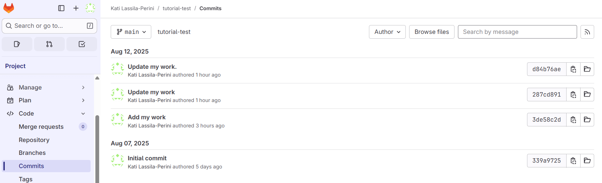

:::::::::::::::::::::::::::::::::::::: questions

- Uh-oh! I already pushed — how can I fix my commit now?

::::::::::::::::::::::::::::::::::::::::::::::::

::::::::::::::::::::::::::::::::::::: objectives

- Changing without breaking.
- Exercise with reverting commits.
::::::::::::::::::::::::::::::::::::::::::::::::

## Already pushed and it went wrong?

If you are working on your own code, you might be pushing your commits directly to the master/main branch.

We come to the collaborative works soon, and talk about using branches and protecting master/main branch so that only assigned contributors can push to it directly. This protection is a feature of the Git hosting platforms like GitLab and GitHub, not a built-in feature of plain Git itself.

For now, let us assume that you push your updates to your repository (or you are the one who has the right to do so in the common repository), so there's no "merge request" (MR) on the GitLab side.

You've done your commits and now you push. You can check the contents of your commits with `git show`. 

```
$ git show --pretty="" --name-only
work.txt
```

It is also good practice to check your remote setting before pushing, for example:

```
$ git remote -v
origin  git@gitlab.com:<your user name>/tutorial-test.git (fetch)
origin  git@gitlab.com:<your user name>/tutorial-test.git (push)
```

`origin` is a shorthand for the full address which you use in your push:

```
$ git push origin main
Enumerating objects: 10, done.
Counting objects: 100% (10/10), done.
Delta compression using up to 2 threads
Compressing objects: 100% (6/6), done.
Writing objects: 100% (9/9), 871 bytes | 45.00 KiB/s, done.
Total 9 (delta 0), reused 0 (delta 0)
To gitlab.com:katilp/tutorial-test.git
   339a972..d84b76a  main -> main
```

You can see your separate commits listed in "History" on the GitLab Web UI, even if you pushed only once:



You can browse files on the Web UI, or inspect them in your local area with `git show <commit hash>` (both short and long forms of the commit hash work).

Now, we will exercise doing changes. 

::: callout
Note that amending the commit with `git commit --amend` once it has been pushed the remote repository is not recommended:

> Only amend commits that are still local and have not been pushed somewhere. Amending previously pushed commits and force pushing the branch will cause problems for your collaborators. 
:::

Commits can be undone with `git revert`. For collaborative work, it is consider safer than `git reset` because `reset` changes the commit history.

::::::::::::::::::::::::::::::::::::: challenge

### Exercise 03.1 - git revert

In the list of commits, undo a commit with `git revert <commit hash>`.

:::::::::::::::: solution

On your local Git area, find the last commit to undo.

You will see something like this:

```
$ git log --oneline
d84b76a (HEAD -> main, origin/main, origin/HEAD) Update my work.
287cd89 Update my work
3de58c2  Add my work
339a972 Initial commit
```

and you can undo the latest change with

```
$ git revert d84b76a
[main a77d646] Revert "Update my work."
 1 file changed, 1 deletion(-)
```

Check the status

```
$ git status
On branch main
Your branch is ahead of 'origin/main' by 1 commit.
  (use "git push" to publish your local commits)

nothing to commit, working tree clean
```

and push

```
$ git push
Enumerating objects: 5, done.
Counting objects: 100% (5/5), done.
Delta compression using up to 2 threads
Compressing objects: 100% (2/2), done.
Writing objects: 100% (3/3), 339 bytes | 33.00 KiB/s, done.
Total 3 (delta 0), reused 0 (delta 0)
To gitlab.com:katilp/tutorial-test.git
   d84b76a..a77d646  main -> main
```

:::::::::::::::::::::::::
:::::::::::::::::::::::::::::::::::::::::::::::


::::::::::::::::::::::::::::::::::::: keypoints 

- Once commits have been pushed to the remote repository, make your changes so that the commit history is kept - unless you want to modify it.

::::::::::::::::::::::::::::::::::::::::::::::::